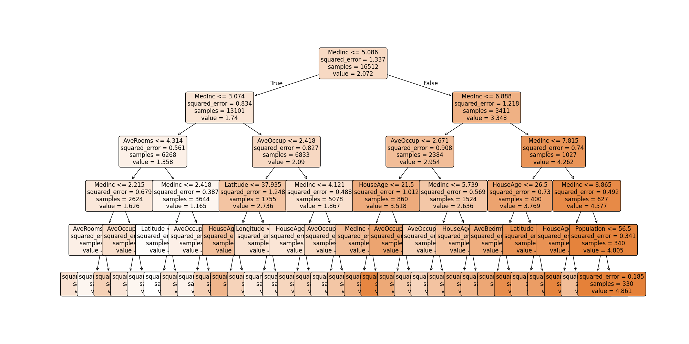
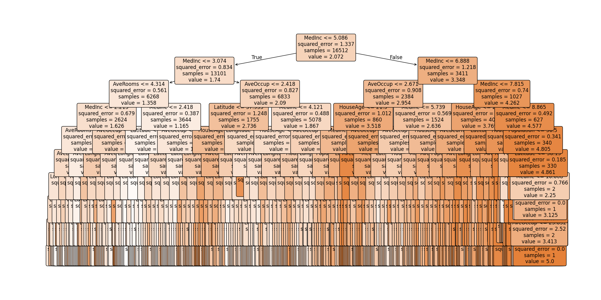
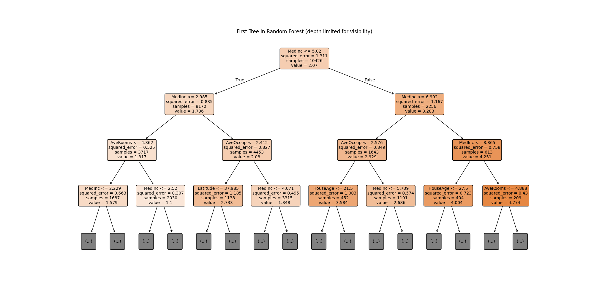

# Lab 6 - Decision Tree & Random Forest

This lab applies Tree-based models to the California Housing dataset, exploring Decision Trees, Random Forests, and Feature Importance.

## Overview

In this lab, we will:

1. **Decision Trees**: Single tree construction, visualization, and pruning
2. **Random Forests**: Ensemble learning with Bagging and OOB evaluation
3. **Feature Importance**: Interpreting what the model learned

## Dataset

We use the [California Housing Dataset](https://inria.github.io/scikit-learn-mooc/python_scripts/datasets_california_housing.html) which contains information about housing prices in California districts.

## Key Visualizations

### Data Exploration

Initial data visualization showing the relationship between median income and house values, plus the correlation matrix:

### Decision Tree Model

A single decision tree with max_depth=9 to prevent overfitting:

The decision tree analysis shows how different tree depths affect model performance, helping identify the optimal depth to balance bias and variance.

### Random Forest Model

Random Forest improves upon single decision trees by creating an ensemble of trees. Here's a visualization of the first tree in the forest:

## Model Performance

The lab compares Decision Tree vs Random Forest performance:

- **Decision Tree**: Single model, prone to overfitting
- **Random Forest**: Ensemble of trees with better generalization
- **OOB Score**: Out-of-Bag validation provides internal model assessment

## Key Concepts Covered

- **Pre-pruning**: Limiting tree depth to avoid overfitting
- **Bagging**: Bootstrap aggregating for ensemble learning
- **Feature Importance**: Identifying which features contribute most to predictions
- **Overfitting Analysis**: Comparing train vs test performance across different hyperparameters

## Getting Started

Open `lab6.ipynb` in Jupyter Notebook or JupyterLab and run the cells sequentially to:

1. Load and explore the California Housing dataset
2. Train and visualize Decision Trees
3. Build and evaluate Random Forest models
4. Analyze feature importance
5. Compare model performance

## Requirements

- pandas
- matplotlib
- seaborn
- scikit-learn
- numpy
